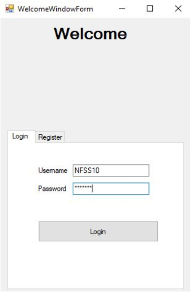
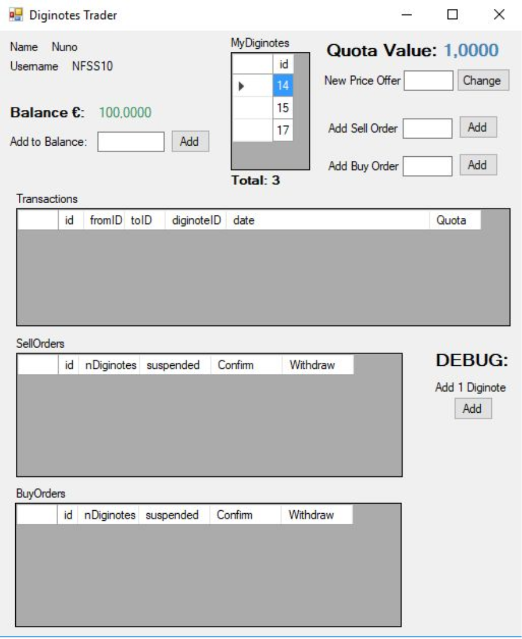
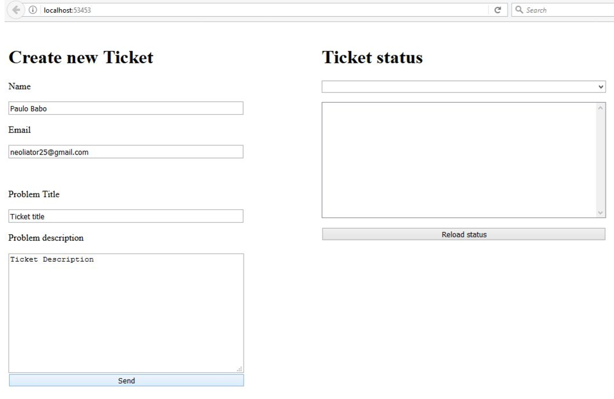
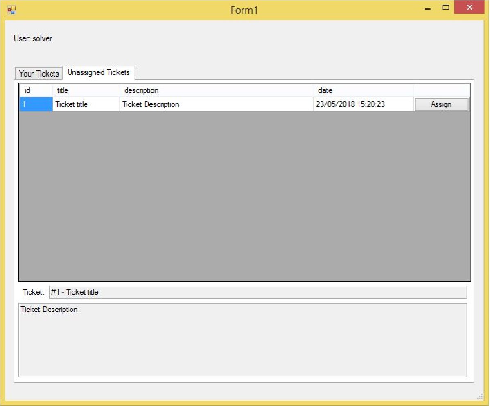
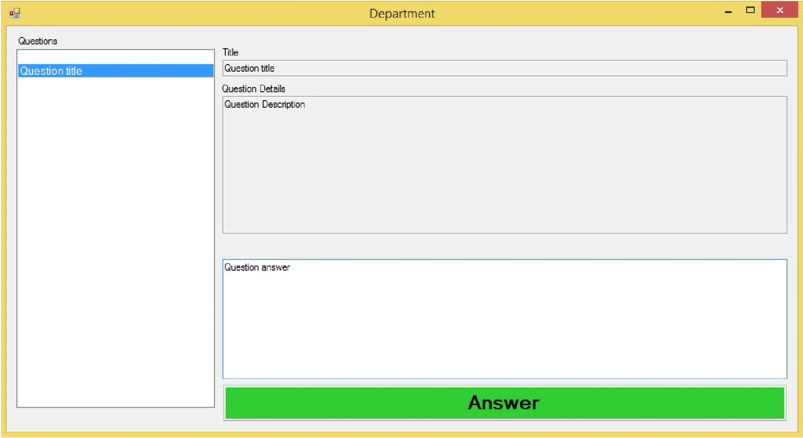

# TDIN Distribution and Integration Technologies
Projects made in Distribution and Integration Technologies class - MIEIC 4y2s 

## Project 1 - .NET Remoting
The project had use develop and graphic application using C# and .Net to buy and sell a digital coin named "Diginote". For more information on implemention details and how the application works, see the report: 
 
Login form

Trading platform

### How to run
1º Open Server.exe located in "TDINA1V1/Executables/Server/"
2º Open Client.exe located in "TDINA1V1/Executables/Client/"

You can open multiple instances of the Client.
There are already 2 registered users in the database that were used in tests.
Account 1:
> Username: NFSS10
>
> Password: pass123

Account 2:
> Username: PAULAO
>
> Password: pass123

## Project 2 - An enterprise distributed systems
This second project lead us to develop of a platform using WCF Services and MSMQ. This platform is used by a company in order to solve problems that are presented as "Trouble Tickets". These tickets are then given to a "Solver" that has the function of solving these tickets. The solver can also send questions to other departments of the company to help him solve the problem. For more information on how the platform works and the implemention details, see the report: 

Create ticket page

Solver's unassigned ticket window

Department questions list
